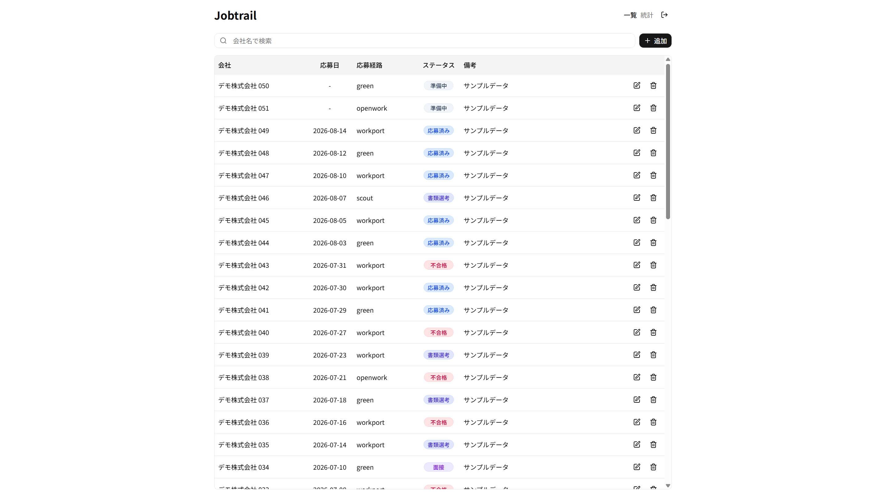
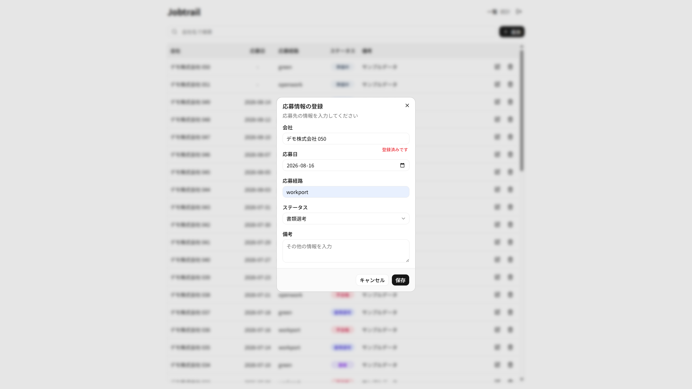
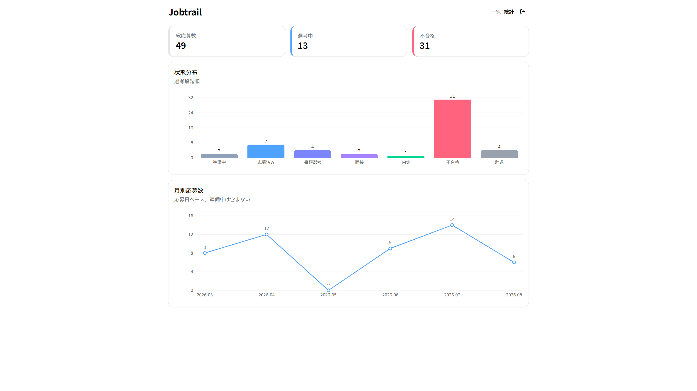

# Jobtrail

転職活動の応募履歴を管理するWebアプリ

[](https://react.dev/)
[](https://www.typescriptlang.org/)
[](https://vite.dev/)
[](https://tailwindcss.com/)
[](https://supabase.com/)
[](https://vercel.com/)

**デモ**: https://jobtrail-ruddy.vercel.app/
ログイン画面の「ゲストで試す」から、アカウント登録なしで動作を確認できます。

---

## 目次

1. [プロジェクトについて](#プロジェクトについて)
2. [動作画面](#動作画面)
3. [技術選定理由](#技術選定理由)
4. [設計で意識したこと](#設計で意識したこと)
5. [環境](#環境)
6. [今後の展望](#今後の展望)

---

## プロジェクトについて

転職活動の応募先をスプレッドシートで管理していたが、以下の点で限界があった。

- 応募社数が増えるにつれ、同じ企業に重複応募しかけることがあった
- 「今どの企業が選考中か」を把握するのに毎回フィルタをかける必要があった
- 応募ペースが落ちていることに気づきにくかった

これらを解決するために作成した。ポートフォリオを兼ねているが、開発者自身と知人数名が実際に日々使用している。

`master` へのマージで Vercel に自動デプロイされる。

### 主な機能

| 機能 | 説明 |
|---|---|
| 応募履歴のCRUD | 企業名・状態・応募日・応募経路・メモを登録／編集／削除 |
| 状態管理 | 準備中／応募済み／書類選考／面接／内定／不合格／辞退 の7段階 |
| 重複警告 | 登録・編集時に同名企業が既にあれば警告を表示 |
| 企業名検索 | 入力に応じてリアルタイムに絞り込み |
| 統計 | 状態分布・月別応募数のグラフ、サマリー数値 |
| 認証 | Google OAuth + RLSによるユーザーごとのデータ分離 |
| ゲストログイン | デモ用アカウントで動作確認が可能 |

---

## 動作画面

| ログイン画面 | 応募一覧画面 |
| --- | --- |
|  |  |

| 登録ダイアログ | 統計画面 |
| --- | --- |
|  |  |

※ スクリーンショットはすべてデモ用のサンプルデータです。

---

## 技術選定理由

### React + TypeScript + Vite

業務では WebSquare と Vue を使っており、React と TypeScript は独学で学んでいる。
学習と実用を兼ねるため、SSRやSEOが不要なこのアプリでは Next.js ではなく Vite を選んだ。
ビルドの仕組みが単純で、学習中に「フレームワークがやってくれていること」と「自分が書いていること」の境界が見えやすいと判断した。

### Supabase

個人開発でバックエンドの実装と運用に時間を取られたくなかった。
PostgreSQL・認証・RLS が揃っており、RLS を使えばユーザーごとのデータ分離をアプリケーション側のロジックなしに実現できる。
複数人が同じアプリを使う前提だったため、この点を重視した。
リージョンは東京を選択している。

### TanStack Query

当初は `useEffect` + `useState` でデータ取得を書いていたが、更新後の再取得を手動で書く箇所が増えてきた。
「実際に困ってから導入する」という方針で進めていたため、この時点で導入した。
`invalidateQueries` によってキャッシュの更新が宣言的になり、コンポーネントから再取得のロジックが消えた。

### shadcn/ui

コンポーネントの見た目より、データフローと設計の学習に工数を使いたかった。
npm パッケージではなくコードが手元にコピーされる方式のため、必要になった時点で中身を読んで調整できる点も選定理由になっている。

---

## 設計で意識したこと

### API層の分離

コンポーネントから Supabase を直接呼ばず、`src/api/applications.ts` に集約している。
開発初期はモックデータで実装し、後から Supabase に差し替えたが、**コンポーネント側の変更は一切不要だった**。

DBは snake_case、フロントは camelCase のため、この層の `toApplication` / `toRow` で変換している。

### 単一の情報源

応募状態の定義（ラベル・表示順・色）を定数オブジェクトに集約し、型は `keyof typeof` で導出している。

```ts
export const APPLICATION_STATUS = {
  draft: { label: "準備中", order: 0, color: "var(--color-slate-400)" },
  ...
} as const

export type ApplicationStatus = keyof typeof APPLICATION_STATUS
```

バッジ・セレクトボックス・グラフの3箇所が参照する。
一覧のバッジとグラフの棒が同じ色になるため、文字を読まずに状態を判別できる。

DBスキーマの型は `supabase gen types` で自動生成している。

### 抽象化のタイミング

「重複が痛みになる前に抽象化しない」方針をとった。

登録フォームと編集フォームは入力項目が完全に一致し、片方だけを変える理由がないため `ApplicationForm` に共通化した。
一方でローディング表示は、用途が異なる（全画面／領域内）ことが分かるまで共通化していない。
早すぎる共通化は boolean の分岐を生み、結局2つのコンポーネントになる。

### 集計ロジックの分離

集計は `src/lib/stats.ts` に切り出し、グラフは加工済みの配列を受け取るだけにしている。

`countByStatus` はグラフとサマリーカードの両方が参照するため、コンポーネント側で数えると集計ルールの変更時に数値がずれる。
`countByMonth` は参照箇所が1つだが、応募のなかった月を0で埋める処理が複雑なため切り出した。
データのある月だけを並べると、活動を休んだ期間がグラフから消えてしまう。

### 方針から外れていた箇所の修正

`ApplicationForm` だけが「通信はコンポーネントに置かない」方針の例外で、重複警告のために自身でデータを取得していた。
`useApplications` を抽出して親がデータを持つようになったため、props で渡す形に変更した。

### 実装しなかったもの

**応募経路ごとの通過率** — 最も知りたい指標だが、`applications` テーブルが現在の状態しか持たないため計算できない。
`rejected` の1件が書類落ちか面接落ちか区別がつかない。到達した最高段階を保持するカラムを追加すれば計算可能になる。

**月別の状態分布** — 内定が出た時点で使われなくなるアプリのため、月別の傾向を論じるだけの期間データが蓄積されない。

### グラフで意識したこと

- **0件の状態も表示する** — 「面接0件」と「面接という段階が存在しない」は別の情報
- **準備中は月別集計から除外する** — 応募日が未定のため。グラフの副題に明記している

---

## 環境

| 言語・フレームワーク・ライブラリ | バージョン |
| --- | --- |
| Node.js | 22 |
| TypeScript | 6 |
| React | 19 |
| Vite | 8 |
| Tailwind CSS | 4 |
| TanStack Query | 5 |
| React Router | 7 |
| Recharts | 3 |

その他のパッケージのバージョンは `package.json` を参照。

### ローカルでの起動

```bash
npm install
cp .env.example .env.local   # Supabaseの接続情報を設定
npm run dev
```

### DBスキーマ変更時

```bash
npm run gen:types   # supabase から型定義を再生成
```

---

## 今後の展望

**機能**
- 応募経路ごとの面接到達率（`max_stage` カラムの追加が前提）
- 状態・応募経路によるフィルタ、列クリックによるソート
- 日本国税庁の法人番号APIとの連携による企業名の表記統一
- モバイル対応（テーブル → カードビュー）

**品質**
- Vitest による単体テスト（純粋関数から着手）
- GitHub Actions による lint / build の自動実行
- ルート単位のコード分割によるバンドルサイズの削減

([トップへ](#jobtrail))